# Ethereum Blockchain Connector - Simulated IOT Device

In this example, we are going to simulate an IOT device that sends data to an IOT hub for temperature and humidity. It will monitor the incoming data stream via Azure Stream Analytics for a given range over a window of time (to filter anomalies).

If the data is outside the range we will log that event to an Ethereum based blockchain.

If you don't have an Azure subscription, [create a free account](https://azure.microsoft.com/free/) before you begin.

The following image illustrates the stages of the solution.

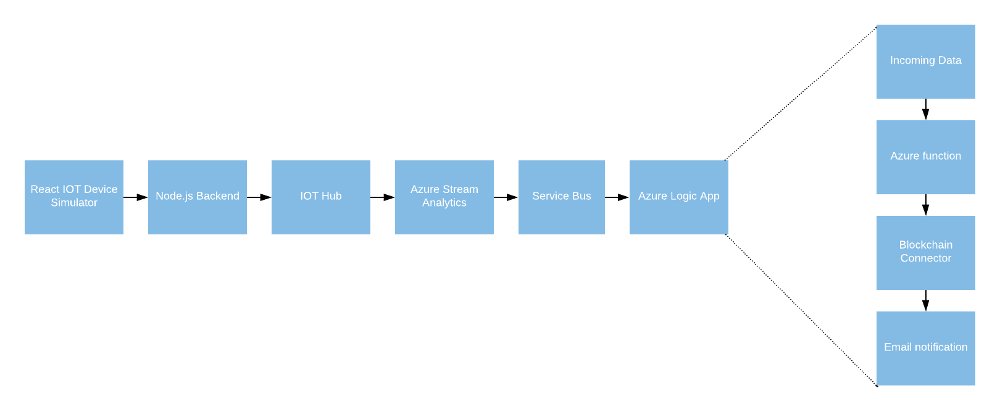

## Description of components

#### React.js IoT Device Simulator

A simple React application that has an interactive slider that can be used to modify the values of temperature and humidity.

#### Node.js Backend

An Express.js application that uses the Node.js Device SDK for IoT Hub: https://github.com/Azure/azure-iot-sdk-node

#### IoT Hub

An [IoT Hub](https://docs.microsoft.com/en-gb/azure/iot-hub/) Hub to capture data from devices.

#### Azure Stream Analytics

An [Azure Stream Analytics](https://docs.microsoft.com/en-gb/azure/stream-analytics/) to process data in real time

#### Service Bus

A [Service bus messaging service](https://docs.microsoft.com/azure/service-bus-messaging/service-bus-quickstart-portal) to connect the output of the Azure Stream Analytics stage with a logic app that uses a Blockchain connector.

#### Azure Logic App

The [Azure Logic App](https://docs.microsoft.com/en-gb/azure/logic-apps/) receives events from the Service bus, parse the information in a desired format and then logs the information in an smart contract that is deployed to an Ethereum Private Blockchain network.

## Step by Step Guide

The step by step guide is split into 4 parts:

- Part 1: Data collection from Simulator to IoT Hub
- Part 2: Data processing and filter of anomalies
- Part 3: Smart contract deployment
- Part 4: Azure logic app to trigger smart contract when an anomaly is found

### Prerequisites

- An Ethereum private network

You can check this resources to deploy a private network

[Deploy a Quorum Network by Enterprise Ethereum Alliance.](https://azuremarketplace.microsoft.com/marketplace/apps/enterprise-ethereum-alliance.quorum-demo?tab=Overview)

[Deploy and configure an Ethereum blockchain by Microsoft](https://azuremarketplace.microsoft.com/marketplace/apps/microsoft-azure-blockchain.azure-blockchain-ethereum?tab=Overview)

## Part 1: Data collection from Simulator to IoT Hub

The first part involves the data capture from the simulator and then record the information in Azure IoT Hub. 

#### IOT Hub

The first thing we need to do is to create the IOT Hub.

Please follow the instructions [Here](https://docs.microsoft.com/en-us/azure/iot-hub/tutorial-connectivity#create-an-iot-hub) to create it. 

Once we completed the creation of the IOT Hub, we need to [authenticate a sample device](https://docs.microsoft.com/en-us/azure/iot-hub/tutorial-connectivity#check-device-authentication)

Save the connection string, as we are going to need it, in order to be able to push data from our IOT device simulator.

#### Backend

The backend uses [Express.js](https://expressjs.com/)

Go to the server folder and run

> npm install

Once completed, create replace in the .env file the value of your connection string for the IOT Hub that was created before.


Then, run

> npm start

We should be able to see the message 'App is listening on port 5000'

The backend has a single endpoint that can handle post requests in the '/message' route. 

Once the message is received, it will use the Azure IoT Node.js SDK to send a message to the IOT Hub. 

Before we are able to push data to the IOT Hub, we need the IOT Simulator.

#### React.js IOT Device Simulator

The simulator was built with [create-react-app](https://facebook.github.io/create-react-app/docs/adding-typescript) and typescript.

The client also uses [Ant library](https://ant.design/docs/react/introduce)

Go to the client folder and run 

> npm install 

Then 

> npm start

Open your browser and type http://localhost:3000/

The React application has 1 single component, where we set the values of the slider to the internal state of the component. 

There is also a setInterval method that is sending the values of the sliders to the server via post, every 5000 miliseconds or 5 seconds.

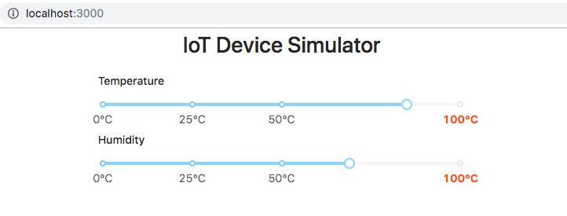

At this point you should be able to see in the express console the temperature and humidity values from the IoT simulator.


Now, we can go to the IOT Hub in the Azure portal and in the metrics section and we should see the messages that were sent.

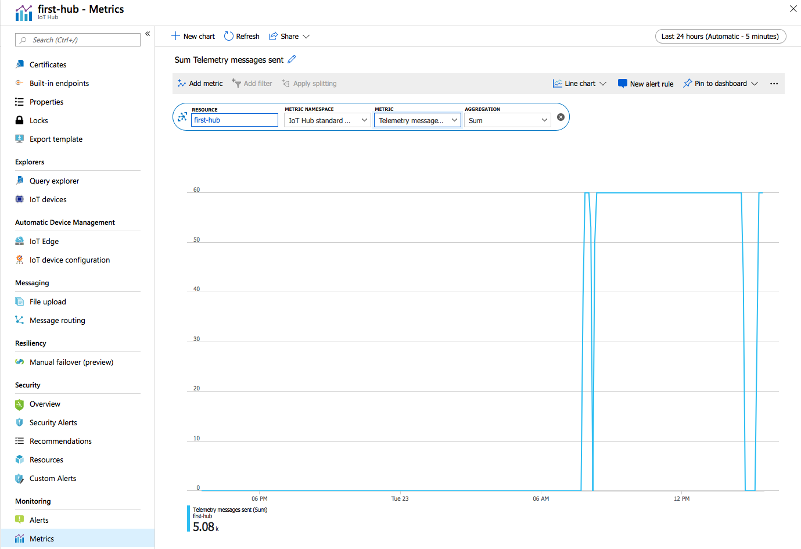

## Part 2: Data processing and filter of anomalies

In this part, we are going to process the information captured in part 1 and we will log the values in an smart contract.

#### Azure Stream Analytics

We need to create an Azure Stream Analytic job.

Follow the instructions [here](https://docs.microsoft.com/en-us/azure/stream-analytics/stream-analytics-quick-create-portal#create-a-stream-analytics-job) for the creation of the job.

Once the job has been created, we need to configure the [job input](https://docs.microsoft.com/en-us/azure/stream-analytics/stream-analytics-quick-create-portal#create-a-stream-analytics-job).

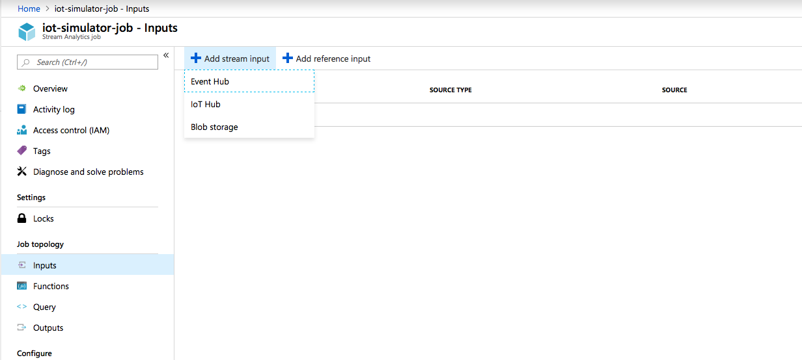

Then we create the input assigning a input alias value and selecting our IoT Hub that we previously created.

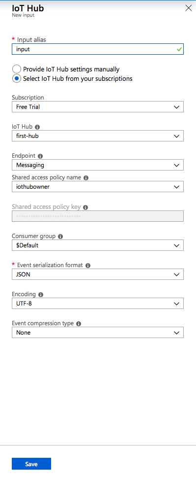

For the configuration of the job output, we will use a [Service Bus Queue](https://docs.microsoft.com/en-us/azure/service-bus-messaging/service-bus-messaging-overview)

To create a service bus queue, we can follow the instructions provided [here](
https://docs.microsoft.com/en-us/azure/service-bus-messaging/service-bus-quickstart-portal).

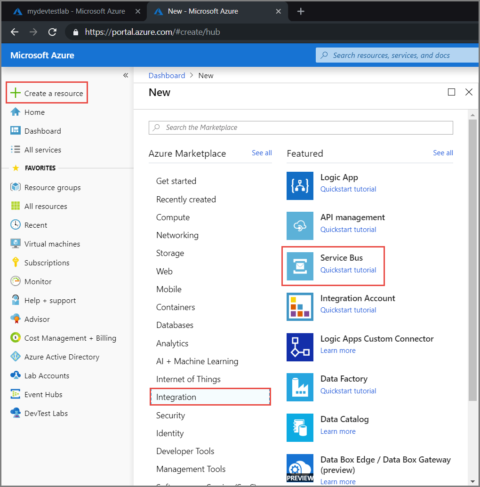

Then we need to [create a queue](
https://docs.microsoft.com/en-us/azure/service-bus-messaging/service-bus-quickstart-portal)

#### Job output

Once the Queue has been created, we need to go to the Azure Stream Analytics and setup the output.

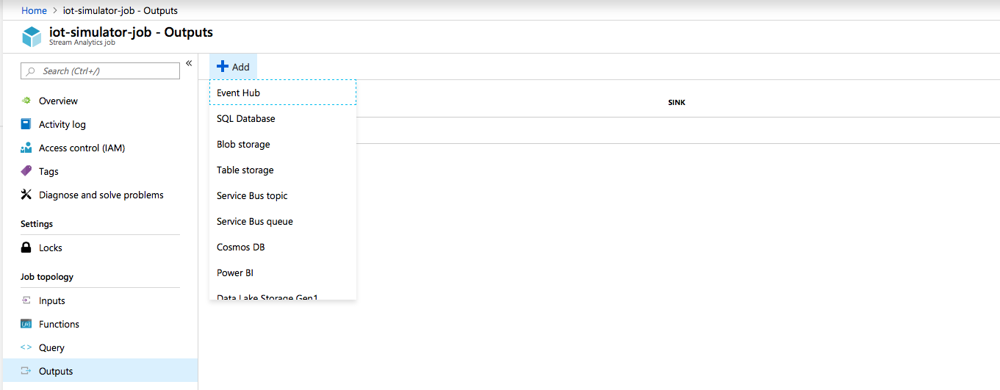

Then, assign an alias

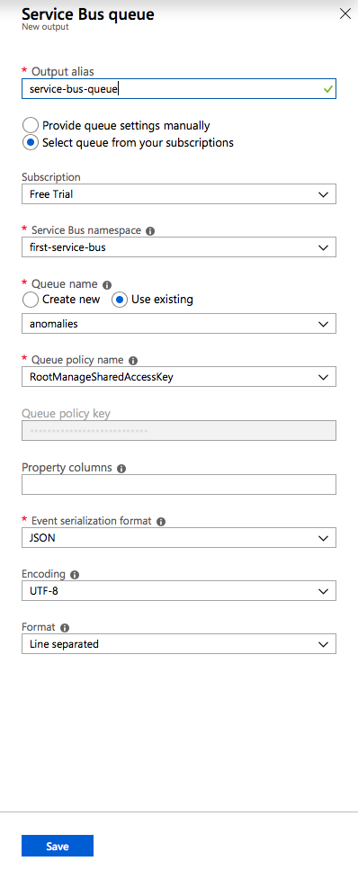

#### Query

We now need to setup a Query to filter anomalies. 

The IoT Hub will provide the information to the Azure Stream Analytics job and we will create a query that is going to measure the average temperature and humidity in a certain window of time.

The query is located in [/extras/query.txt](./extras/query.txt)

```sql
SELECT 
    System.Timestamp AS time,
    Avg(temperature) AS temperature,
    Avg(humidity) AS humidity
FROM
    input TIMESTAMP BY time
GROUP BY TumblingWindow(second,30)
HAVING temperature > 75 AND humidity > 75
```

We have defined an average temperature and humidity range of 75.

It means that, if in a window of 30 seconds, the average of temperature and humidity is greater than 75, then we will output to our Service Bus Queue a message that is going to trigger an Azure Logic App where we will execute a transaction against a real Blockchain.

## Part 3: Smart contract deployment

Go to Remix and create a new contract with the code provided in the /contract folder, which is a minimal version of the [refrigerated transport smart contract](https://github.com/Azure-Samples/blockchain/tree/master/blockchain-workbench/application-and-smart-contract-samples/refrigerated-transportation/ethereum)

In Remix, go to environment and select Web3 Provider


Then, change the provider and use the URL of your virtual machine and the port 22001


Paste the code and deploy the contract using the values:

> 0, 75, 0, 75

Which refers to the minimum and maximum humidity and temperature.

The smart contract has 1 function called IngestTelemetry, which received the humidity, temperature and timestamp.

Within the function, we have a set of conditions that verify if the humidity and temperature are outside a range defined during the creation and put the state of the contract to OutOfCompliance.

## Part 4: Azure logic app to trigger smart contract when an anomaly is found

[Create an Azure Logic App](https://docs.microsoft.com/en-gb/azure/logic-apps/quickstart-create-first-logic-app-workflow#create-your-logic-app) 

Then, create a trigger and select Service Bus

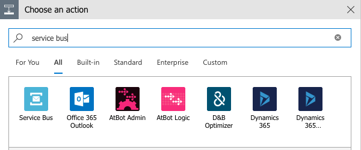

Select the queue and the interval and frequency to check for items in the queue.


As the Service bus encoded the message, i.e 

`@string3http://schemas.microsoft.com/2003/10/Serialization/�3{"Foo":"Bar"}`

we need to deserialize and parse it in an Azure function.

[Create an HTTP triggered function](https://docs.microsoft.com/en-us/azure/azure-functions/functions-twitter-email#create-an-http-triggered-function)

Use the following sample code(also located in [/extras/AzureFunction.cs](./extras/AzureFunction.cs))

```csharp

#r "Newtonsoft.Json"

using System.Net;
using Microsoft.AspNetCore.Mvc;
using Microsoft.Extensions.Primitives;
using Newtonsoft.Json;
using System.Text;

public static async Task<HttpResponseMessage> Run(HttpRequest req, ILogger log)
{
    log.LogInformation("C# HTTP trigger function processed a request.");
    string name = req.Query["content"];

    string requestBody = await new StreamReader(req.Body).ReadToEndAsync();
    log.LogInformation($"Message received {requestBody}");
    
    string base64Decoded = ASCIIEncoding.ASCII.GetString(System.Convert.FromBase64String(requestBody));
    log.LogInformation($"Message decoded {base64Decoded}");

    int start = base64Decoded.IndexOf("{");
    int end = base64Decoded.LastIndexOf("}");
    string result = base64Decoded.Substring(start, end - start + 1);
    log.LogInformation($"Message decoded as JSON {result}");

    dynamic data = JsonConvert.DeserializeObject(result);
    log.LogInformation($"DATA {data}");
    Int32 unixTimestamp = (Int32)(DateTime.UtcNow.Subtract(new DateTime(1970, 1, 1))).TotalSeconds;
    log.LogInformation($"unixTimestamp {unixTimestamp}");
    data.time = unixTimestamp;
    data.temperature = (Int32)data.temperature;
    data.humidity = (Int32)data.humidity;
    
    log.LogInformation($"DATA {data}");
    string jsonToReturn = JsonConvert.SerializeObject(data);

    return new HttpResponseMessage(HttpStatusCode.OK) {
        Content = new StringContent(jsonToReturn, Encoding.UTF8, "application/json")
    };
}

```

Add a next step and add an action to ParseJSON

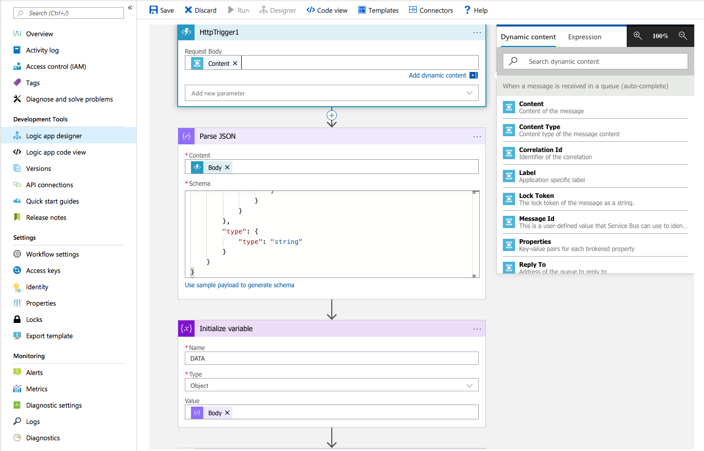

Use the sample payload that is in [/extras/schema-sample.json](./extras/schema-sample.json)

```javascript
{
    "properties": {
        "humidity": {
            "type": "integer"
        },
        "temperature": {
            "type": "integer"
        },
        "time": {
            "type": "integer"
        }
    },
    "type": "object"
}

```

Add a next step and add an action of type "Initialize varialbe" to store the values in a variable

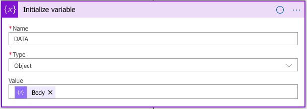

Add a next step and add an action of type "Ethereum Blockchain" to execute the smart contract

Use the ABI that is in the [/contract/RefrigeratedTransportation.json](./contract/RefrigeratedTransportation.json) file and use the address that Remix provides when we deploy the contract.


Add a next step and add an action of type "Send email" to send an email once an out of compliance status has been reached

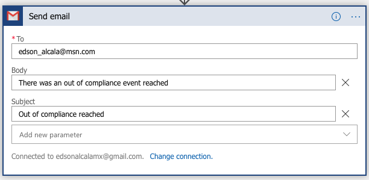

Now, we just need to wait for the next message to arrive and the logic app should run.

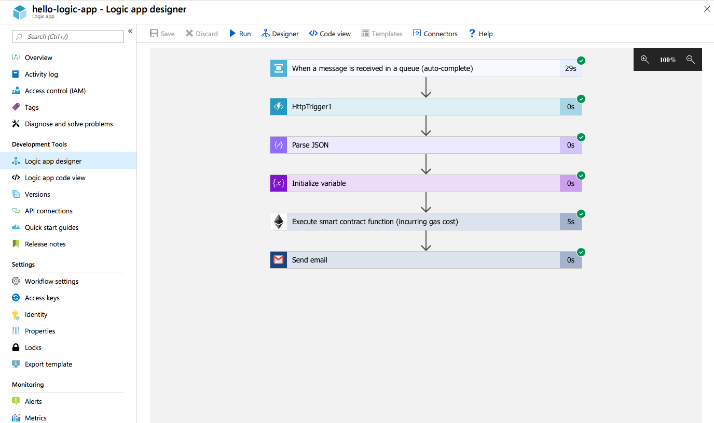

Finally, we can go to Remix and verify the status of the smart contract

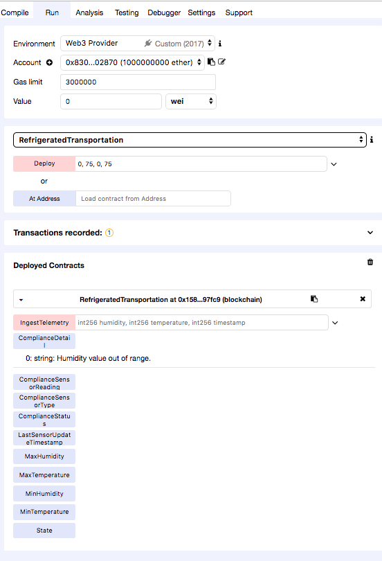